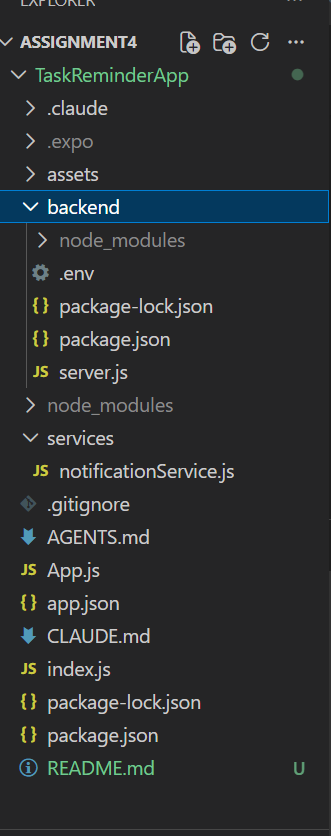
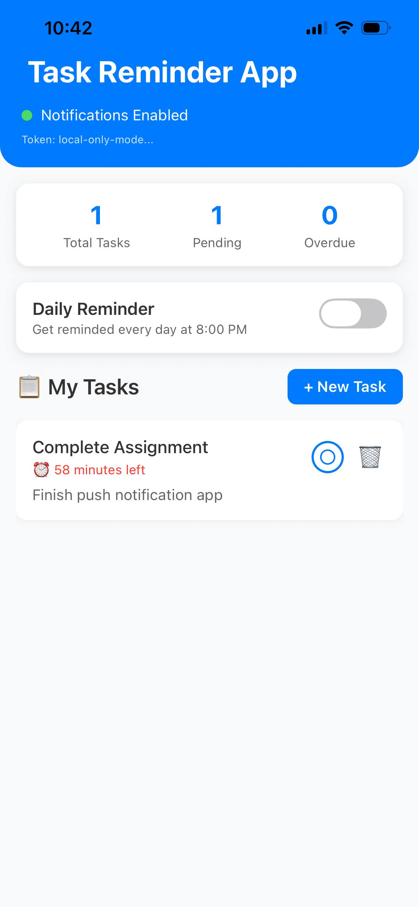
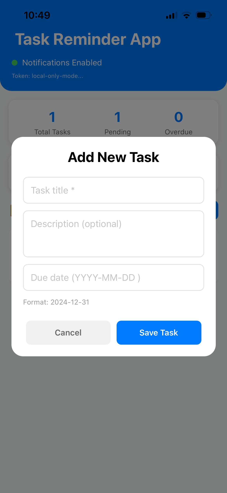
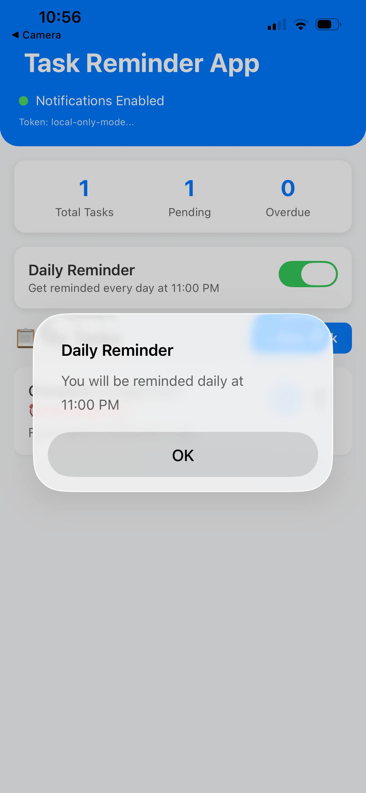
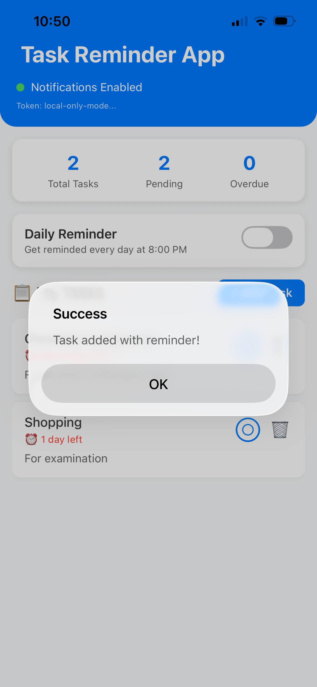
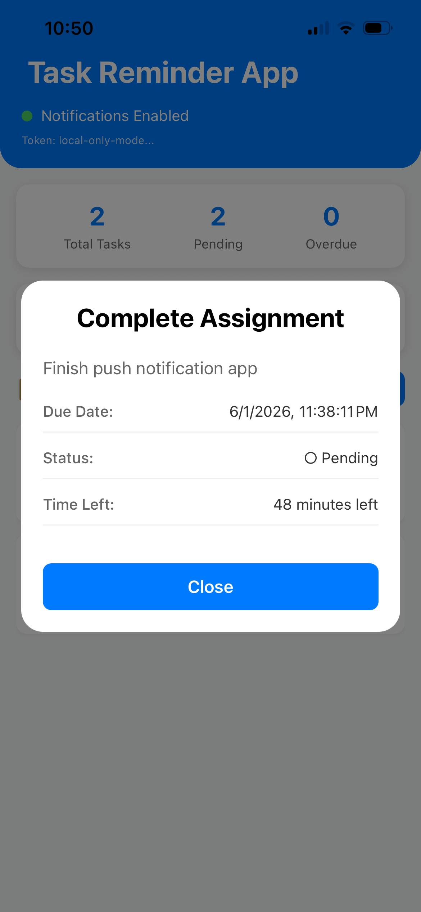

# Task Reminder App - Push Notification Enabled Mobile Application

## App Name and Description
- **TaskReminderApp** is a React Native mobile application built with Expo that helps users manage their daily tasks with intelligent reminder notifications. The app allows users to create tasks with due dates and receives automatic reminders before deadlines.

## Setup Instructions
### Prerequisites
- Node.js 
- npm or yarn
- Expo CLI
- Physical iOS device 
- Git

### Installation
#### Step 1: Clone Repository
- git clone https://github.com/choden12/Assignment_4_SWE.git
- cd Assignment_4_SWE/TaskReminderApp

#### Step 2: Install Mobile App Dependencies
- npm install

#### Step 3: Install Backend Dependencies
- cd backend
- npm install

## Key Features
- Create, complete, and delete tasks with due dates
- Automatic local notifications 10 minutes before task deadlines
- Optional daily reminder at 11:00 AM to review pending tasks
- Remote push notifications via custom backend server
- Real-time notification handling in foreground, background, and terminated states
- Task details view when tapping on notifications

## Domain and Main User Scenario

**Domain:** Task Management & Productivity

**Primary User Scenario:** 
A busy professional needs to remember important deadlines and daily tasks. The app helps by:

1. **Creating Tasks**: User adds tasks with titles, descriptions, and due dates
2. **Automatic Reminders**: System sends notification 10 minutes before each task is due
3. **Daily Planning**: Optional daily reminder at 8:00 PM prompts user to review next day's tasks

## Project Structure

## Notification Types Implemented

### 1. Local Notifications (On-Device)
- Uses Expo Notifications API
- Scheduled with `scheduleNotificationAsync()`

### 2. Remote Push Notifications (Server-Triggered)
- Custom Express.js backend
- Expo Push Notification Service for delivery
- Device tokens registered and stored server-side

## Technology Stack
- Runtime: Node.js
- Framework: Express.js
- Push Service: Expo Push 
- Notification API
- Port: 3000 (default)

## Main Endpoint
1. Post - Register device push token [/api/register-token]
2. POST - Send to specific device [/api/send-notification]
3. POST - Send to all registered devices [/api/broadcast]
4. GET - List all registered tokens [/api/tokens]

## Output

### Screenshot 1: Homepage (Main Task List)

- Main dashboard showing task statistics (Total Tasks: 1, Pending: 1, Overdue: 0), daily reminder toggle, and task list with "Complete Assignment" showing 58 minutes remaining.

### Screenshot 2: Add New Task Modal

- Modal dialog for creating new tasks with fields for task title, description, and due date. Date format follows YYYY-MM-DD pattern.

### Screenshot 3: Daily Reminder Confirmation

- Daily reminder toggle with confirmation dialog showing reminder scheduled at 11:00 AM. This demonstrates the app's recurring notification feature.

### Screenshot 4: Success Message (Task Added)

- Success confirmation after adding a new task. The UI shows updated statistics (Total Tasks: 2, Pending: 2) and the newly added "Shopping" task.

### Screenshot 5: Task Detail View

